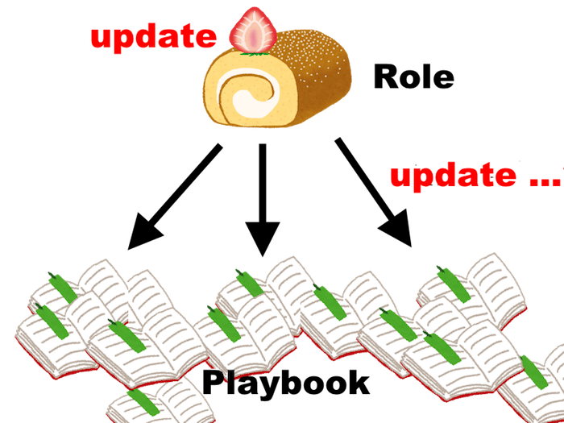

Ansible Roleの継続的自動Update
====

**Ansible Night in Tokyo 2018.04**

chroju

---

## 自己紹介


**chroju**

* [GitHub](https://github.com/chroju) / [Qiita](http://qiita.com/chroju) / [Twitter](https://twitter.com/chroju)
* インフラの面倒を見たり運用の改善したりする仕事
* Ansible / Terraform / influxDB / Python あたり

---

## Infrastructure as Code におけるコードの再利用

* 例えば複数のサービスでnginxを使いたい場合
    * 🙅NG → サービスごとにコードを書く
    * 🙆OK → 1回書いたコードを各サービスで再利用する
* コード再利用でスノーフレークサーバーを防ぐ

---

## Ansible Roleでの再利用

* Ansibleでコードを再利用する仕組みはAnsible Role
    * task, handler, 変数, template等をまとめてモジュール化
* Roleの管理は `ansible-galaxy` コマンドと `requirements.yml` で可能

```
$ ansible-galaxy install bennojoy.nginx
```

```yaml:requirements.yml
- src: https://github.com/bennojoy/nginx
  version: master
  name: nginx_role
```

---

## Roleを再利用


---

## 再利用 ...


---

## Roleを更新すると？



---

**Roleを使い回すほど管理が大変になる**

---

## Roleの更新をPlaybookにどう反映する？

* Roleの更新をいかに各Playbook側でキャッチするのか？
* PlaybookごとにRoleの更新→テストを全部やるのか？
* 1000 Playbookあったら？

**継続的自動的にやるしかないのでは？**

---

## ソフトウェア開発に倣う

> Infrastructure as Codeは、ソフトウェア開発のプラクティスをインフラのオートメーションに活かすアプローチだ。 (Kief Morris『Infrastructure as Code』p.5)


---

## Role ≒ プログラムのpackage

* Ansible RoleはRubyGemsやJSのyarnなど、プログラムで言うpackageやmoduleと似た位置付け
* ソフトウェアでもimported packageの継続的更新は課題になっている
    * [定期的にyarn updateするには - おもしろwebサービス開発日記](http://blog.willnet.in/entry/2018/03/18/163405)
    * [Jenkins に bundle update した上で Pull Request させる - @kyanny's blog](http://blog.kyanny.me/entry/2012/11/06/003902)

---

## Jenkins !! (or CI)


---

## RoleもCIで継続的update

こんな感じでうまくいきそう？

1. 更新確認用のブランチにcheckout
1. installしているroleの更新を確認
1. 更新があればupdate
1. update後にserverspec等テストを回す
1. テストが通ったらJenkinsからPR
1. 結果をslackに通知

---

## `ansible-galaxy` での実現

* やりたいのは requirements.yml の記載バージョンから更新があるかの確認
* しかし requirements.yml にバージョン指定されていると、`install -fr` しても最新は入らない
* 最新を追いかける手段がない😫

---

## バージョンをlockする

* requirements.yml を2種類用意する(Gemfile.lockの発想)
* requirements.lock.yml にバージョン指定を書く
  * 普段の実行時にはこちらを使う
* requirements.yml はバージョン指定しない
  * 更新確認ではこちらを使い、lock.ymlより新しいバージョンが入るか確認する

---

## sample

```
# まずlockからインストール
$ ansible-galaxy install -r requirements.lock.yml
$ ansible-galaxy list -p ./roles > before

# 次にrequirements.ymlから
$ ansible-galaxy install -fr requirements.yml
$ ansible-galaxy list -p ./roles > after

$ if [[ $(diff before after | wc -l) -gt 0 ]]; then ...

# この後でtestしてpushしてPRして通知
```
---

## 余談: Roleの後方互換性

Roleを更新するとき、Playbook側でなるべく作業が必要ないよう配慮する

* Roleの破壊的な変更はなるべくしない
    * Role名や変数名は変えない
    * 変数をdeprecatedにするなら、debug moduleでその旨を実行時に出力するなど、気付かせてあげるべき
* 変数追加時は必ず `defaults/` で初期値を設定する

---

## まとめ

* Ansibleでも依存モジュールを継続的自動更新をするべき
* `ansible-galaxy obsolete` コマンドがほしい
* 何かいい方法があったら教えてほしいです🙇
